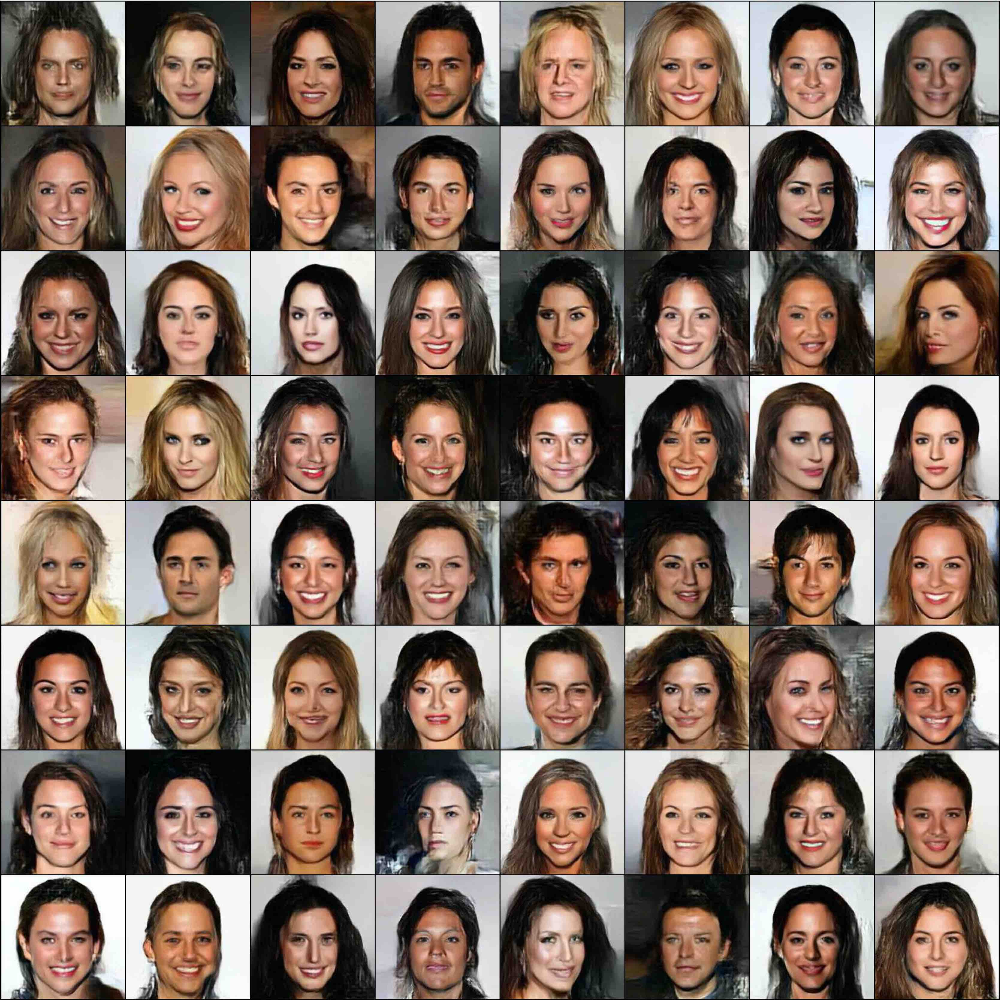
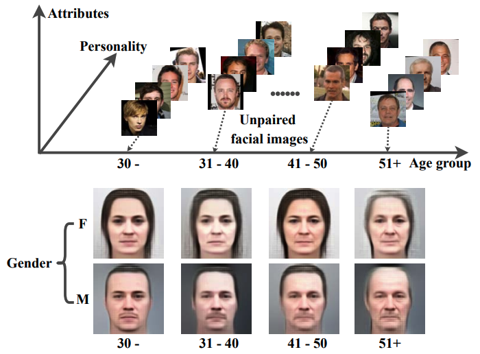
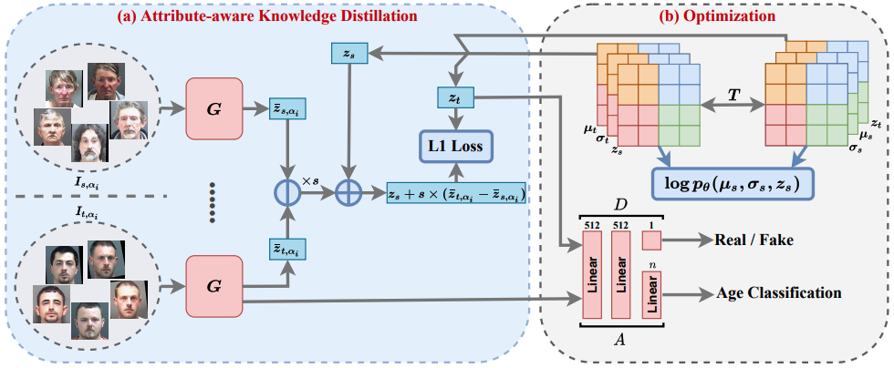

### AgeFlow
This repository contains the PyTorch implementation and the dataset of the paper: **AgeFlow: Conditional Age Progression and Regression with Normalizing Flows (IJCAI 2021)**

> AgeFlow: Conditional Age Progression and Regression with Normalizing Flows<br>
> https://arxiv.org/abs/2105.07239<br>
> Abstract: Age progression and regression aim to synthesize photorealistic appearance of a given face image with aging and rejuvenation effects, respectively. Existing generative adversarial networks (GANs) based methods suffer from the following three major issues: 1) unstable training introducing strong ghost artifacts in the generated faces, 2) unpaired training leading to unexpected changes in facial attributes such as genders and races, and 3) non-bijective age mappings increasing the uncertainty in the face transformation. To overcome these issues, this paper proposes a novel framework, termed AgeFlow, to integrate the advantages of both flow-based models and GANs. The proposed AgeFlow contains three parts: an encoder that maps a given face to a latent space through an invertible neural network, a novel invertible conditional translation module (ICTM) that translates the source latent vector to target one, and a decoder that reconstructs the generated face from the target latent vector using the same encoder network; all parts are invertible achieving bijective age mappings. The novelties of ICTM are two-fold. First, we propose an attribute-aware knowledge distillation to learn the manipulation direction of age progression while keeping other unrelated attributes unchanged, alleviating unexpected changes in facial attributes. Second, we propose to use GANs in the latent space to ensure the learned latent vector indistinguishable from the real ones, which is much easier than traditional use of GANs in the image domain. Experimental results demonstrate superior performance over existing GANs-based methods on two benchmarked datasets.

### Flow-based encoder and decoder

#### DATASETS 
[CELEBA](http://mmlab.ie.cuhk.edu.hk/projects/CelebA.html), [FFHQ](https://github.com/NVlabs/ffhq-dataset) and its aging version [FFHQ-Aging](https://github.com/royorel/Lifespan_Age_Transformation_Synthesis). Please note that the source celeba dataset is not aligned by FFHQ style, and most importantly they are not in square size.

#### Training
the source code is in available in `flow` folder. please run the following code to train a flow-based encoder.
```shell
# Train a model with image size 64, dataset FFHQ, 
# [no actnorm, reverse permutation, additive coupling], 
# 16 bs updated for every 1 iteration
# classification loss weight 0.001.
python train.py \
    --batch_size 16 \
    --max_iter 1000000 \
    --n_flow 32 \
    --n_block 4 \
    --n_bits 5 \
    --lr 1e-4 \
    --img_size 64 \
    --temp 0.7 \
    --gradient_accumulation_steps 1 \
    --checkpoint_iter 100000 \
    --generation_iter 100 \
    --dataset_name FFHQ \
    --network_config 1 \
    --cls_loss_weight 0.001
```
```shell
# Train a model with image size 256, dataset CELEBA, 
# [actnorm, inv conv, additive coupling], 
# 32 bs updated for every 2 iteration (need 4 v100)
# classification loss weight 0.0.
python train.py \
    --batch_size 32 \
    --max_iter 1000000 \
    --n_flow 32 \
    --n_block 6 \
    --n_bits 5 \
    --lr 1e-5 \
    --img_size 256 \
    --temp 0.7 \
    --gradient_accumulation_steps 2 \
    --checkpoint_iter 100000 \
    --generation_iter 100 \
    --dataset_name CELEBA \
    --network_config 0 \
    --cls_loss_weight 0.0
```
#### Pre-trained models

The pre-trained flow models can be downloaded from:
* Baidu Disk: https://pan.baidu.com/s/1H2RB-Fc-hS9F8wwb3SWlDQ and rxqg
* [Dropbox](https://www.dropbox.com/sh/vdsx16p5qe3pua2/AAATyV3iX6xzHpngi6CAeEx3a?dl=0)
Here is some examples generated from celeba datasets.


#### Some Tips 

It is hard to train flow-based models, especially for the big image size such as 256. Here I provide some tips for training flow-based models:
1. GLOW preprocessed the input image with 5 bits, which can reduce the training difficulties. Such a trick is necessary for 256 image size. I have also tried to remove it for 256 image size but failed.
2. The 2nd config, i.e., [no actnorm, reverse permutation, additive coupling], performs more stable than GLOW, although it seems to achieve a lower loglikelihood.
3. The distributed training is not applicable for the flow model, especially with Adam optimizer. So I have chosen the `DataParallel`. I know it is strange. However, it is common for deeper flows without the normalization layers. For distributed training, the SGD and Adam with large weight decay are ok, but they converge slower than vanilla Adam.
4. The learning rate is very small. As mentioned above, there is no BN in the flow model. Therefore, I have not performed lr decay during training.
5. Conditional Generation. It is very simple to modify my code to adjust the conditional generation. Just parse the conditions to the `condition` argument.

#### Requirements
```
torch==1.8.1
tqdm
torchvision
```

### Age Progression and Regression
I am still working on cleaning the source code of age progression and regression for the public. Please wait for a moment.

### Illustration

* learned face latent space and decoded average latent variables.


* Generator


* Training


#### Citation

If you found this code, pre-trained model, or our work useful please cite us:

```
@article{huang2021ageflow,
  title={AgeFlow: Conditional Age Progression and Regression with Normalizing Flows},
  author={Huang, Zhizhong and Chen, Shouzhen and Zhang, Junping and Shan, Hongming},
  journal={IJCAI},
  year={2021},
}
```